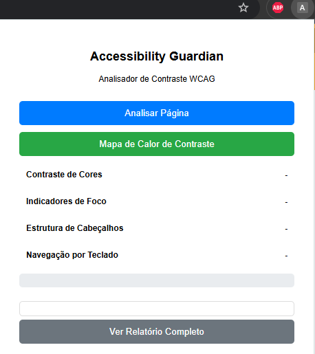
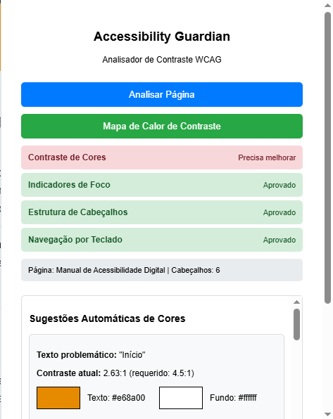
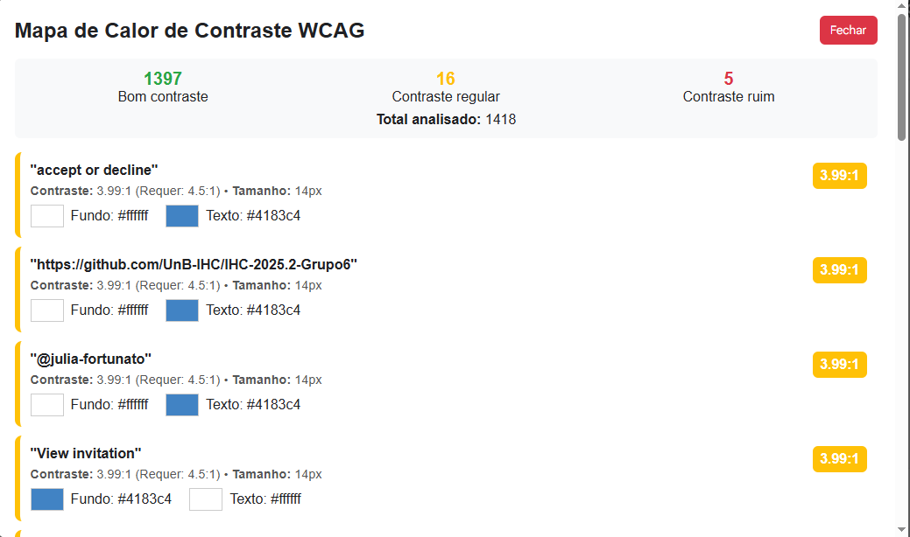
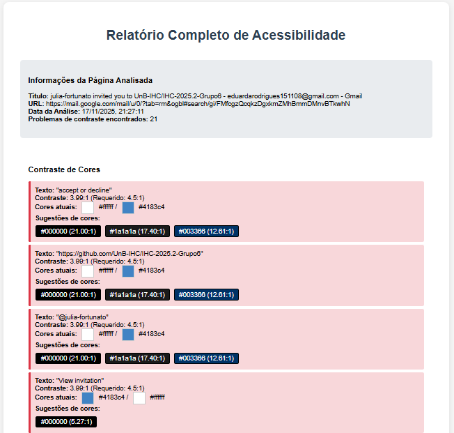
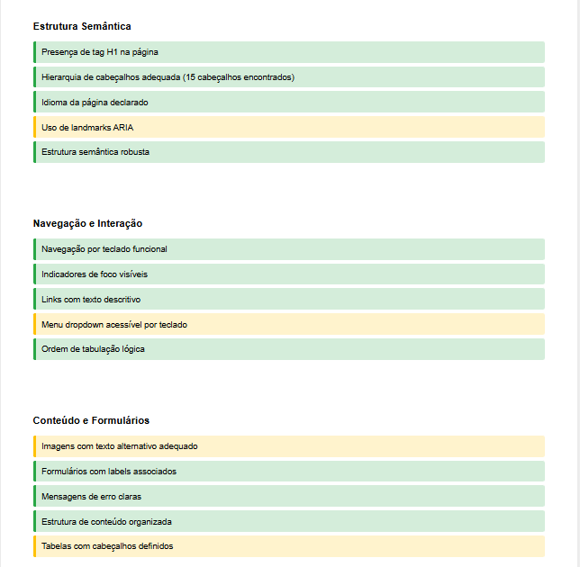

#  Accessibility Guardian  
### Extensão para Análise Rápida de Acessibilidade em Páginas Web

O **Accessibility Guardian** é uma extensão para navegador desenvolvida para ajudar estudantes, desenvolvedores e designers a identificar problemas básicos de acessibilidade em páginas web.  
Com apenas um clique, a ferramenta avalia critérios essenciais seguindo recomendações da WCAG (Web Content Accessibility Guidelines, em português, Diretrizes de Acessibilidade para Conteúdo Web.) .

---

##  Funcionalidades

A extensão realiza quatro verificações principais:

### **1. Contraste de Cores**
- Calcula automaticamente o contraste entre o texto e o fundo da página usando a fórmula oficial da WCAG.
- Informa se o contraste atinge o nível mínimo recomendado (4.5:1).

### **2. Indicadores de Foco**
- Identifica a presença de elementos focáveis na página.
- Avalia se a navegação por teclado é possível.

### **3. Estrutura de Cabeçalhos**
- Conta todos os elementos `<h1>` a `<h6>`.
- Verifica se a página possui ao menos um `<h1>`.

### **4. Navegação por Teclado**
- Verifica se existe suporte mínimo para navegação por teclado através dos elementos focáveis.

---

##  Como Funciona

A extensão utiliza a API de extensões do Chrome para:

- Identificar a aba ativa.
- Injetar um script de análise dentro da página.
- Ler estilos, elementos e estrutura semântica.
- Exibir os resultados dentro do popup da extensão.

A função principal, `runAccessibilityChecks()`, é responsável por coletar e retornar todos os dados analisados.

---

##  Como Usar

1. Ative o modo desenvolvedor no ```chrome://extensions/```.
2. Clique em **Carregar sem compactação**.
3. Selecione a pasta da extensão.
4. Abra qualquer página da web.
5. Clique no ícone da extensão.
6. Pressione **"Analisar Página Atual"**.
7. Veja o resultado das verificações diretamente no popup.

---

##  Tecnologias Utilizadas

- **JavaScript**  
- **HTML e CSS**  
- **Chrome Extensions API**  
- **WCAG Color Contrast Formula**

---

##  Estrutura de Arquivos

```text
/Extensão A11y/
├── manifest.json
├── popup.html
├── popup.js
├── results.html
├── results.js
└── icons/
    └── acessibilidade.png
```


---

## Cálculo de Contraste (WCAG)

O cálculo segue a fórmula oficial:

### **1. Luminância relativa**

``` L = 0.2126R + 0.7152G + 0.0722B```


### **2. Razão de contraste**
```(L1 + 0.05) / (L2 + 0.05)```


### **Aprovado se:**
```contraste >= 4.5```

## 📸 Capturas de Tela

###  Popup da extensão


###  Tela de analise de página


###  Mapa de contraste 


###  Relatorio

